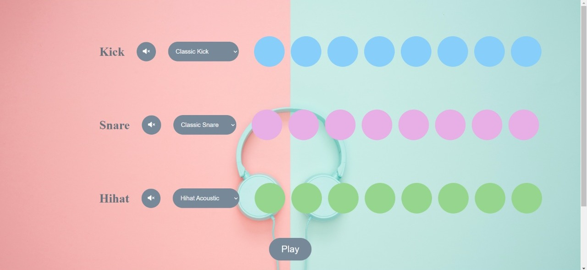
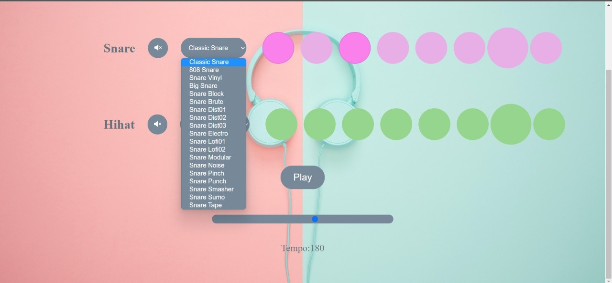

  
  

  <!-- You are encouraged to replace this logo with your own! Otherwise you can also remove it. -->
  
- [📝 License](#license)

<!-- PROJECT DESCRIPTION -->

# 📖 [Beat-Maker] 

> Describe your project in 1 or 2 sentences.

**[BeatMaker]** is a beatmaker application user can become DJ

## 🛠 Built With 

### Tech Stack 

>

> Add a link to your deployed project.

- [Live Demo Link](https://darling-pastelito-6cdcbc.netlify.app/)

(<a href="#readme-top">back to top</a>)

<!-- GETTING STARTED -->

<!-- AUTHORS -->

## 👥 Authors 

👤 **Nurgul**

- GitHub: [@githubhandle](https://github.com/NurkaAmre)
- Twitter: [@twitterhandle](https://twitter.com/AmreNurgul)
- LinkedIn: [LinkedIn](https://www.linkedin.com/in/amre-nurgul/)

(<a href="#readme-top">back to top</a>)

<!-- SUPPORT -->

## ⭐️ Show your support 

> Write a message to encourage readers to support your project

If you like this project...

(<a href="#readme-top">back to top</a>)

<!-- ACKNOWLEDGEMENTS -->

## 🙏 Acknowledgments 

> Give credit to everyone who inspired your codebase.

I would like to thank for MR.Deved...

(<a href="#readme-top">back to top</a>)

<!-- FAQ (optional) -->

#

(<a href="#readme-top">back to top</a>)

<!-- LICENSE -->

## 📝 License 

This project is [MIT](./LICENSE) licensed.

_NOTE: we recommend using the [MIT license](https://choosealicense.com/licenses/mit/) - you can set it up quickly by [using templates available on GitHub](https://docs.github.com/en/communities/setting-up-your-project-for-healthy-contributions/adding-a-license-to-a-repository). You can also use [any other license](https://choosealicense.com/licenses/) if you wish._

(<a href="#readme-top">back to top</a>)

